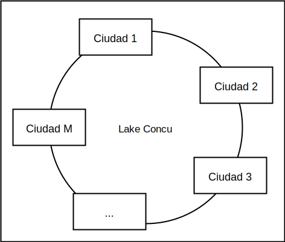
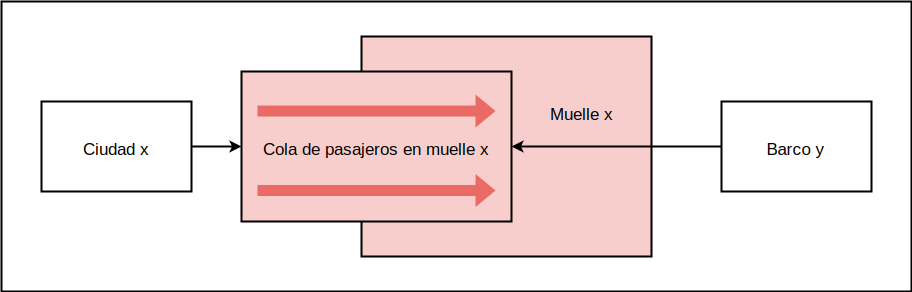
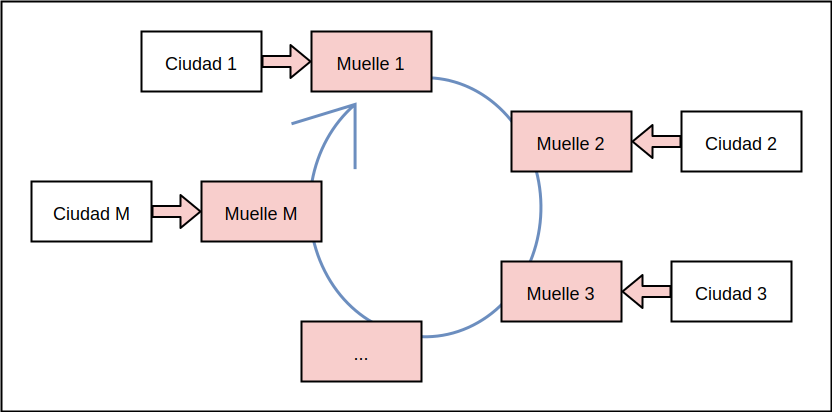
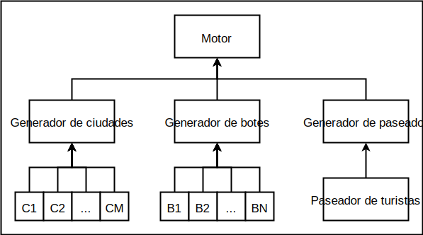
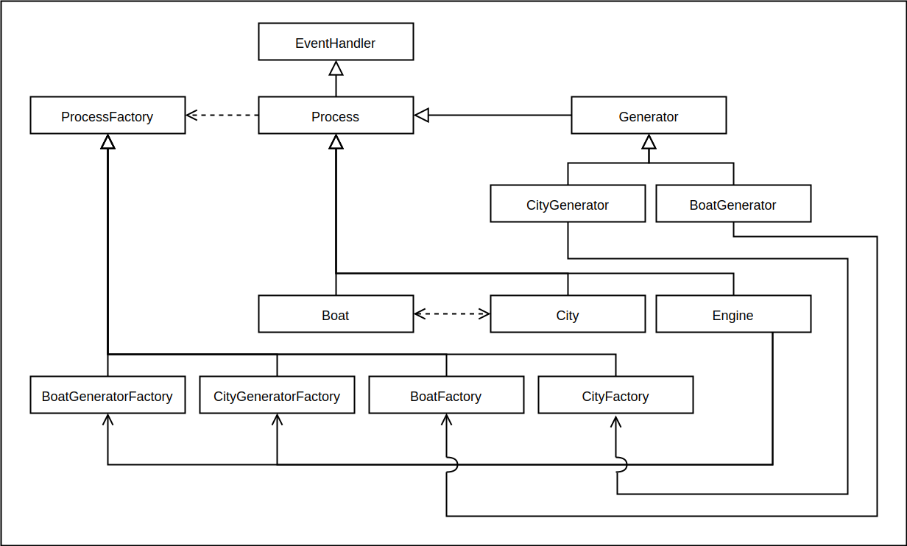

### Resumen del enunciado

Debemos simular el escenario que se describe a continuación. 

Hay un lago llamado *Lake Concu*, con varias ciudades dispersas a lo largo de su perímetro.

Figura 1: Lake Concu

Existe una empresa de transporte lacustre que presta su servicio en Lake Concu con $N$ barcos. Los barcos se desplazan entre las distintas ciudades recogiendo pasajeros y llevándolos a otras ciudades.

En cada ciudad hay un muelle, al que llegan pasajeros esperando subir a un barco. Los pasajeros pueden ser turistas y no turistas. Los no turistas tienen un destino definido, mientras que los turistas no necesariamente.

Los barcos se acercan a los muelles de las ciudades para cargar y descargar personas; en un cierto muelle puede haber a lo sumo un único barco en un cierto instante de tiempo; si un barco llega a un muelle que ya está ocupado, deberá esperar para tomar el muelle.

Cuando un barco toma un muelle, procede a descargar a aquellos no turistas que tuvieran como destino esa ciudad particular, y también a los turistas que casualmente decidan bajar allí. Los turistas que bajen en una ciudad particular podrán decidir caminar hasta otra ciudad para, eventualmente, volver a subir a un barco. Habiendo descargado los pasajeros, el barco procederá a cargar a los pasajeros que estén esperando en el muelle para subir.

Adicionalmente, en las ciudades pueden subir al barco inspectores de pasajes y oficiales de la prefectura naval. Cuando un inspector de pasajes sube a un barco, procederá a verificar que todos los pasajeros tengan sus pasajes; aquellos que no los tengan deberán bajar del barco y pagar una multa. Los oficiales de la prefectura naval, por otro lado, verificarán que el conductor del barco tenga todos los papeles en orden; de no ser el caso, todos los pasajeros deberán bajar y el barco será decomisado.

### Diseño de la solución

#### Procesos fundamentales

Implementamos una solución particionando el problema en procesos independientes. Los procesos principales son los **barcos** y las **ciudades**. Los pasajeros no fueron representados como procesos, sino como estructuras de datos que en un cierto instante de tiempo pueden estar bajo control de un cierto proceso particular.

La simulación se define en la interacción entre los barcos y las ciudades, la cuál pasaremos a describir a continuación. Existen también procesos adicionales que detallaremos luego. 

Cada ciudad tiene un identificador, un número entero positivo que la distingue del resto de las ciudades. En principio, el rol de cada ciudad es generar pasajeros. Cada cierta cantidad de tiempo, una cierta ciudad particular identificado por el identificador $x$ genera un pasajero $p$, que puede ser o un turista, o un no turista. Tanto turistas como no turistas pueden tener ticket o no, según una cierta distribución de probabilidad. Adicionalmente, los no turistas tienen un destino fijo; es decir, bajarán del barco únicamente cuando lleguen a la ciudad destino.

La ciudad $x$ procede a acolar al turista $p$ en una cola $Q_x$. Cada ciudad tiene su propia cola, en la cuál se acolan pasajeros esperando para subir a un barco. La cola $Q_x$ es un recurso compartido, y el acceso es exclusivo: solo un proceso a la vez puede estar acolando datos, o leyendo datos, de una cierta cola particular.

Figura 2: Interacción ciudad-barco. Las cajas con fondo rojo son recursos de uso exclusivo.

Eventualmente, un barco se acercará al muelle de la ciudad $x$. Para cumplir con la condición de que solamente puede haber un barco por muelle al mismo tiempo, el muelle también es un recurso de acceso exclusivo: cuando un barco se acerca a un muelle, debe solicitar el acceso al mismo, y de estar ya ocupado, deberá esperar a que se desocupe.

En un cierto instante de tiempo, un barco $y$ lleva una cantidad de pasajeros $n_y \geq 0$, con $n_y$ a lo sumo igual a la capacidad de los barcos $C$ (es decir, $n_y \leq C$), la cuál es configurable. Habiendo obtenido acceso al muelle de la ciudad $x$, el barco $y$ comienza descargando pasajeros. Por cada pasajero en el barco, el procedimiento es el siguiente:

1. Si se trata de un no turista, y su destino es efectivamente la ciudad $x$, se procede a descargar el pasajero. Si su destino no es la ciudad $x$, se ignora y se evalúa el pasajero siguiente.
2. Si se trata de un turista, se evalúa una variable aleatoria para determinar si el pasajero quiere bajar o no en la ciudad $x$. Si el pasajero decide bajar, se lo baja; en caso contrario, se continúa con el siguiente pasajero. Adicionalmente, si el turista decide bajar, se evalúa otra variable aleatoria para determinar si el turista sale del sistema, o si se irá caminando hasta otra ciudad. De resultar que el turista seguirá paseando, se lo coloca en una cola compartida $P$ de pasajeros paseando; cómo se maneja esta cola se detallará luego.

Habiendo bajado a todos los pasajeros del barco, se procede a cargar pasajeros esperando en el muelle $x$. En principio, el barco $y$ determina la cantidad de espacio libre con el que cuenta; es decir, la cantidad $l_y$ de asientos disponibles. Habiendo determinado $l_y$, procede entonces a intentar tomar hasta $l_y$ pasajeros de la cola $Q_x$, tomando a lo sumo la cantidad de elementos en la cola. 

Es importante notar que la cola de pasajeros $Q_x$ no queda bloqueada durante todo el proceso de carga; el barco procede a tomar $l_y$ elementos de la cola, almacenándolos en memoria local, y luego liberando la cola para que la ciudad pueda seguir acolando elementos. Habiendo obtenido la lista de pasajeros en el muelle, el barco procede a cargarlos uno por uno.

Habiendo terminado la carga de pasajeros, y antes de que el barco parta, pueden en darse dos eventos: primero, puede ser que un inspector de pasajes suba al barco; en ese caso, se procede a descargar del barco a todos aquellos pasajeros que no tengan boleto; segundo, puede darse que un prefecto naval suba al barco, caso en el que se evaluará una variable aleatoria para determinar si el barco tiene o no sus papeles en órden, y en caso de no tenerlos, se bajará a todos los pasajeros y se detendrá el proceso del barco $y$.

Finalmente, el barco $y$ libera el recurso compartido del muelle $x$ y procede hacia la siguiente ciudad. El recorrido de los barcos es circular alrededor de la orilla del lago:

Figura 3: La curva azul representa el recorrido de un barco.

#### Procesos adicionales

En adición a los barcos y a las ciudades, existen también otros procesos adicionales.

* **Motor**: Es el proceso padre, encargado de inicializar el sistema; mientras la simulación está en curso, el motor recibe comandos por consola, lo que permite evaluar estadísticas y finalizar la simulación si fuese necesario.
* **Generadores**: La instanciación de barcos y de ciudades está a cargo de procesos denominados generadores, que cada cierta cantidad de tiempo configurable, instancian algún proceso hijo, hasta una cantidad máxima; estos procesos también se encargan de esperar la finalización de sus hijos y limpiar procesos zombie periódicamente.
* **Paseador de turistas**: Como se mencionó en la sección anterior, existe una probabilidad no nula de que un turista que baja en una ciudad decida irse a pasear y subir a un barco en otra ciudad; adicionalmente, se mencionó que los turistas que se van a pasear son acolados en una cola compartida $P$. El proceso paseador de turistas despierta periódicamente y verifica si hay algún elemento en $P$, y de haber, lo envía a una ciudad elegida aleatoriamente.

El árbol de procesos se esquematiza en la figura 4.

Figura 4: Árbol de procesos.

La jerarquía de clases se esquematiza en la figura 5. Todos los procesos heredan de una clase `Process`. Para instanciar un proceso, hay que llamar al método `spawn_child` de un cierto proceso particular, pasando un objeto `ProcessFactory` que define la inicialización concreta del proceso. El proceso utiliza el objeto factory para inicializar su nuevo hijo, y lo agrega a una lista de procesos hijos. Los generadores (de tipo `Generator`) son un tipo particular de procesos que, en intervalos periódicos, utilizan un cierto factory para generar procesos hijos; por ejemplo, `BoatGenerator` utiliza `BoatFactory` para instanciar procesos de tipo bote. Por otro lado, el motor `Engine`, que es el primer proceso que se ejecuta, utiliza `BoatGeneratorFactory` y `CityGeneratorFactory` para instanciar los generadores, obteniendo una jerarquía casi como la que se muestra en la figura 4. Adicionalmente, si bien no se muestra en la figura 5, existe también un `WalkerGenerator` que instancia un proceso `Walker` , que tiene la tarea de pasear turistas de una ciudad a otra.

Figura 5: Jerarquía de clases; solo se muestran las clases más importantes.

### User stories

#### Caso 1

_Como **usuario de la aplicación** quiero que al correr la aplicación en modo no-debug la aplicación corra sin mostrar mensajes de log en pantalla_

| **Dado** | un usuario con permiso para ejecutar la aplicación |
|:---|:---|
|**Cuando** | el usuario la ejecuta en modo no-debug |
|**Entonces** | se muestra un mensaje introductorio explicándole cómo se correrá la aplicación |

| **Dado** | la aplicación corriendo en modo no-debug |
|:---|:---|
|**Cuando** | ocurre un evento que resulta en un log |
|**Entonces** | ese log no se muestra en pantalla ni en ningún otro lado |

---

#### Caso 2

_Como **usuario de la aplicación** quiero que al correr la aplicación en modo debug la aplicación corra sin mostrar mensajes de log en pantalla y se genere un archivo de log con los mensajes loggeados_

| **Dado** | un usuario con permiso para ejecutar la aplicación |
|:---|:---|
|**Cuando** | el usuario la ejecuta en modo debug |
|**Entonces** | se muestra un mensaje introductorio explicándole cómo se correrá la aplicación |

| **Dado** | la aplicación corriendo en modo debug |
|:---|:---|
|**Cuando** | ocurre un evento que resulta en un log |
|**Y** | no existe el archivo de log |
|**Entonces** | ese log no se muestra en pantalla ni en ningún otro lado |
|**Y** | ese log no se muestra en pantalla |
| **Y** | se crea el archivo de log |
| **Y** | se escribe el mensaje en el archivo |

---

#### Caso 3

_Como **usuario de la aplicación** quiero que al ingresar por consola el comando 'quit' el programa se detenga completamente, sin pérdida de memoria compartida, semáforos y sin dejar procesos colgados_

| **Dado** | un usuario con permiso para ejecutar la aplicación |
|:---|:---|
| **Y** | la aplicación está corriendo |
| **Cuando** | el usuario ingresa por consola el comando _quit_ |
| **Entonces** | la aplicación se detiene |
| **Y** | se muestra un mensaje en pantalla indicando que se detuvo la aplicación exitosamente |

| **Dado** | la aplicación detenida luego de ejecutar el comando _quit_ |
|:---|:---|
| **Cuando** | el usuario ejecuta el comando _ps_ |
| **Entonces** | no se ven procesos relacionados a la aplicación |

| **Dado** | la aplicación detenida luego de ejecutar el comando _quit_ |
|:---|:---|
| **Cuando** | el usuario ejecuta el comando _ipcs_ |
| **Entonces** | no se ven segmentos de memoria compartida ni semáforos asociados a la aplicación |

---

#### Caso 4

_Como **usuario de la aplicación** quiero que la corrida del proceso no resulte en pérdida de memoria_

| **Dado** | un usuario con permiso para ejecutar la aplicación |
|:---|:---|
| **Cuando** | el usuario la corre utilizando Valgrind |
| **Entonces** | Valgrind no registra reportes de procesos con pérdida de memoria |

---

#### Caso 5

_Como **motor de la aplicación** quiero generar barcos para que transporten pasajeros por las ciudades, que su cantidad y capacidad sean configurables_

| **Dado** | el motor de la aplicación |
|:---|:---|
| **Cuando** | la aplicación se inicia |
| **Entonces** | el motor de la aplicación genera procesos barco |

| **Dado** | el motor de la aplicación |
|:---|:---|
| **Cuando** | la aplicación se inicia |
| **Entonces** | el motor de la aplicación genera tantos procesos barco como aparecen en el archivo `config.ini` bajo el tag `BOAT_COUNT` |

| **Dado** | el motor de la aplicación |
|:---|:---|
| **Cuando** | la aplicación se inicia |
| **Entonces** | el motor de la aplicación genera tantos procesos barco con capacidad igual al número que aparece en el archivo `config.ini` bajo el tag `BOAT_CAPACITY` |

---

#### Caso 6

_Como **motor de la aplicación** quiero generar ciudades para que alberguen a los pasajeros y reciban barcos que los transporten entre ellas_

| **Dado** | el motor de la aplicación |
|:---|:---|
| **Cuando** | la aplicación se inicia |
| **Entonces** | el motor de la aplicación genera procesos ciudad |

| **Dado** | el motor de la aplicación |
|:---|:---|
| **Cuando** | la aplicación se inicia |
| **Entonces** | el motor de la aplicación genera mínimamente 2 procesos ciudad |

---

#### Caso 7

_Como **ciudad** voy a generar pasajeros para que recorran el lago en barco_

| **Dado** | una ciudad del programa |
|:---|:---|
| **Cuando** | se inicia la aplicación |
| **Entonces** | se generarán cada cierto tiempo pasajeros con origen en esta ciudad|

---

#### Caso 8

_Como **ciudad** voy a generar pasajeros que sean trabajadores (con un destino específico) o turistas (sin destino específico) para que recorran el lago de formas distintas_

| **Dado** | una ciudad del programa |
|:---|:---|
| **Cuando** | se inicia la aplicación |
| **Entonces** | se generarán pasajeros no turistas que tendrán un destino fijo, determinado por una probabilidad |

| **Dado** | una ciudad del programa |
|:---|:---|
| **Cuando** | se inicia la aplicación |
| **Entonces** | se generarán pasajeros turistas que no tendrán un destino fijo, determinado por una probabilidad |

---

#### Caso 9

_Como **ciudad** voy a encolar a los pasajeros generados en una cola a la espera de un barco que los pueda transportar_

| **Dado** | una ciudad del programa |
|:---|:---|
| **Y** | un pasajero |
| **Cuando** | el pasajero es creado |
| **Entonces** | se encola el pasajero en la cola de la ciudad a esperar un barco |

| **Dado** | una ciudad del programa |
|:---|:---|
| **Y** | un pasajero |
| **Cuando** | el pasajero es creado |
| **Y** | no existe cola para la ciudad |
| **Entonces** | se crea la cola de la ciudad como memoria compartida |
| **Y** | se encola el pasajero en la cola de la ciudad a esperar un barco |

---

#### Caso 10

_Como **ciudad** que recibir un único barco a la vez en mi muelle_

| **Dado** | una ciudad del programa |
|:---|:---|
| **Cuando** | un barco llega a la ciudad |
| **Y** | no hay ningún barco en el muelle |
| **Entonces** | dejo que el barco amarre en el muelle |

| **Dado** | una ciudad del programa |
|:---|:---|
| **Cuando** | un barco llega a la ciudad |
| **Y** | hay barco en el muelle |
| **Entonces** | el barco se encola en una cola esperando amarrar al muelle |

| **Dado** | una ciudad del programa |
|:---|:---|
|**Cuando** | un barco llega a la ciudad |
| **Y** | hay barco en el muelle |
| **Y** | no existe cola para el muelle |
|**Entonces** | se crea la cola del muelle como memoria compartida |
|**Y** | el barco se encola en esa cola esperando amarrar al muelle |

| **Dado** | una ciudad del programa |
|:---|:---|
| **Y** | hay barco en el muelle |
| **Y** | hay barcos esperando en la cola |
|**Cuando** | el barco zarpa |
|**Entonces** | el primer barco en la cola sale de ella y amarra en el muelle |

---

#### Caso 11

_Como **barco** quiero poder descargar mis pasajeros no-turistas en el muelle_

| **Dado** | un barco del programa con pasajeros |
|:---|:---|
| **Cuando** | el barco llega a la ciudad |
| **Entonces** | el barco hace descender a los pasajeros no-turistas cuyo destino sea esta ciudad |

| **Dado** | un barco del programa con pasajeros |
|:---|:---|
| **Cuando** | el barco llega a la ciudad |
| **Entonces** | el barco no fuerza a descender a los pasajeros no-turistas cuyo destino no sea esta ciudad |

| **Dado** | un barco del programa con pasajeros |
|:---|:---|
| **Y** | el barco no tiene pasajeros |
| **Cuando** | el barco llega a la ciudad |
| **Entonces** | nadie desciende del barco |

#### Caso 12

_Como **barco** quiero poder descargar mis pasajeros turistas en el muelle_

| **Dado** | un barco del programa con pasajeros |
|:---|:---|
| **Cuando** | el barco llega a la ciudad |
| **Entonces** | el barco hace descender a los pasajeros turistas que quieran bajar en esta ciudad con cierta probabilidad |

| **Dado** | un barco del programa con pasajeros |
|:---|:---|
| **Cuando** | el barco llega a la ciudad |
| **Entonces** | el barco no fuerza a descender a los pasajeros turistas que decidieron no bajar en esta ciudad |

#### Caso 13

_Como **barco** quiero poder cargar pasajeros en el muelle_

| **Dado** | un barco del programa con pasajeros |
|:---|:---|
| **Cuando** | el barco llega a la ciudad |
| **Entonces** | el barco sólo empieza a cargar pasajeros cuando terminó de descargar los pasajeros que tenían que bajar |

| **Dado** | un barco del programa con pasajeros |
|:---|:---|
| **Cuando** | el barco terminó de bajar pasajeros |
| **Y** | el barco sigue lleno |
| **Entonces** | el barco no carga ningún pasajero en el muelle y zarpa |

| **Dado** | un barco del programa con pasajeros |
|:---|:---|
| **Cuando** | el barco terminó de bajar pasajeros |
| **Y** | el barco tiene lugar |
| **Entonces** | el barco carga pasajeros de la cola del muelle en orden hasta ocupar su capacidad |

| **Dado** | un barco del programa con pasajeros |
|:---|:---|
| **Cuando** | el barco terminó de bajar pasajeros |
| **Y** | el barco tiene lugar |
| **Y** | no hay pasajeros en la cola del muelle |
| **Entonces** | el barco no carga pasajeros y zarpa del muelle |

#### Caso 14

_Como **inspector** quiero poder hacer bajar pasajeros de barcos que no tengan ticket_

| **Dado** | un barco en una ciudad |
|:---|:---|
| **Cuando** | el barco terminó de cargar pasajeros |
| **Entonces** | el inspector decide inspeccionar con cierta probabilidad el barco |

| **Dado** | un barco en una ciudad |
|:---|:---|
| **Cuando** | el inspector sube a inspeccionar pasajes |
| **Y** | un pasajero no tiene ticket |
| **Entonces** | pasajero baja del barco y se suma 1 al contador de "Pasajeros sin ticket bajados" |

#### Caso 15

_Como **prefecto** quiero poder inspeccionar barcos que amarran en un muelle para ver que estén en condiciones, y si no, decomisarlos_

| **Dado** | un barco en una ciudad |
|:---|:---|
| **Cuando** | el barco terminó de cargar pasajeros |
| **Entonces** | el prefecto decide inspeccionar con cierta probabilidad el barco |
| **Y** | esa probabilidad es menor que la del inspector de tickets |

| **Dado** | un barco en una ciudad |
|:---|:---|
| **Cuando** | el prefecto inspecciona el barco |
| **Entonces** | decide con cierta probabilidad decomisarlo |
| **Y** | descarga a todos los pasajeros, acolándolos en el muelle |
| **Y** | el proceso barco es terminado y se suma 1 al contador de "Naves decomisadas" |

#### Caso 16

_Como **usuario de la aplicación** quiero conocer la cantidad de pasajeros que fueron bajados por no tener ticket y de naves decomisadas_

| **Dado** | un usuario que ejecuta la aplicación |
|:---|:---|
| **Cuando** | el usuario ingresa por consola el comando `count` |
| **Entonces** | se imprime por pantalla "Pasajeros sin ticket bajados:" seguido de la cantidad de pasajeros que fueron bajados hasta el momento |
| **Y** | se imprime por pantalla "Naves decomisadas:" seguido de la cantidad de barcos que fueron decomisados hasta el momento |

***TODO*** Caso del turista que decide caminar
